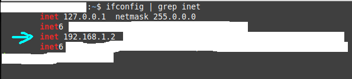

# Api de Cursos

## Configuração do Banco de dados

- Executar o seguinte script SQL:

`CREATE DATABASE api_cursos;`

`` CREATE TABLE `api_cursos`.`cursos` ( `id` INT NOT NULL AUTO_INCREMENT , `titulo` VARCHAR(255) NOT NULL , `descricao` VARCHAR(8000) NOT NULL, `imagem` VARCHAR(300) NOT NULL , `created_at` DATETIME NOT NULL DEFAULT CURRENT_TIMESTAMP , `updated_at` DATETIME on update CURRENT_TIMESTAMP NOT NULL DEFAULT CURRENT_TIMESTAMP , PRIMARY KEY (`id`)) ENGINE = InnoDB CHARSET=utf8 COLLATE utf8_general_ci; ``

- Informações adicionais:
  - **Hostname**: localhost
  - **Schema**: api_cursos
  - **User**: root
  - **Password**: 12345

## Configuração localhost para consumir a API em um dispositivo físico mobile

- Executar o seguinte comando no terminal linux:

`ifconfig | grep inet`

Esse comando irá obter o endereço inet.

Exemplo:

Acesse o seguinte arquivo:

`application/config/config.php`

Procure pela variável `$config['base_url']` e atribua a ela o IP obtido e uma porta.

Exemplo:

`$config['base_url'] = 'http://192.168.1.2:8000/';`

## Execução da API

Para iniciar a API execute o seguinte comando no terminal, utilizando o IP obtido e a porta utilizada:

Exemplo :
`php -S 192.168.1.2:8000`
